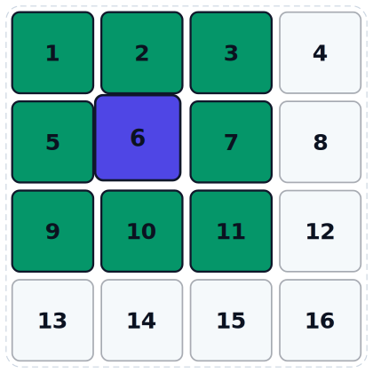

# Advanced implementation

Here I am assuming that you have at least read the [base version](Implementation.md) of the implementation procedure.

Here I will introduce a few much more advanced concepts:

 - link cells algorithm, as described by Allen, and as implemented in plumed in the `LinkCells` class (you can get it with `"#include "plumed/tools/LinkCells.h"
 - what is the shared memory in Cuda

### How does LinkCells work?

