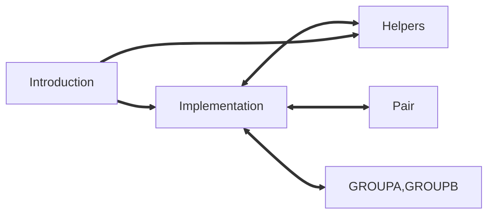

# Rewriting the coordination for plumed in Cuda

Here I am showing how to set up a plug-in that is compiled with the cuda compiler
and that can be LOADed in plumed.
The project consists in two parts: the actual
[coordination implementation](Implementation.md) and a [helper module](Helpers.md)
 with the reduction algorithm and a tool for easing memory management.

