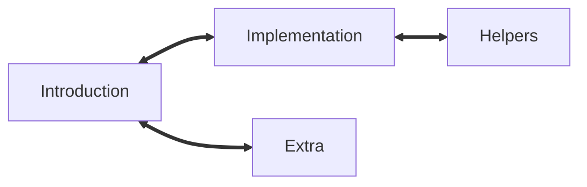

# Rewriting the coordination for plumed in Cuda

Here I am showing a very simple example of how to implement the calculation of the coordination within a group of atoms.

```mermaid
flowchart LR

Intro[Introduction]
Implementation
Extra
Helpers

Intro <==> Implementation
Implementation <==> Helpers
Intro <==> Extra

click Intro "Readme.md" "The introduction"
click Implementation "Implementation.md" "The coordination implementation"
click Helpers "Helpers.md" "A simple manual witht the helper library"
click Extra "Extra.md" "The manual for the companion header"
```
